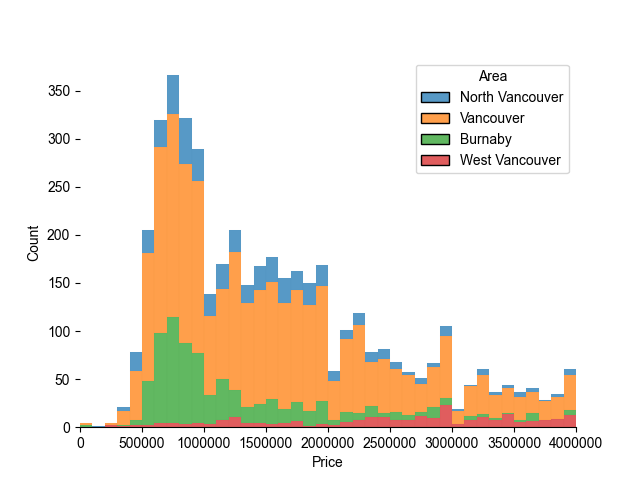

# vancouver-housing
Web scraping Vancouver real estate data from Remax and analysing it

Current Functionality:
Step 1: Run the python script to scrape all Vancouver houses for sale from the Remax.ca website
Step 2: Run the visualisation script to see a histogram of the distribution based on Area and Price

Improvements to make:
Make python code automatically clean data better (there are a few data quality issues I had to manually filter out in Excel)
Expand data to all of BC
More visualisations
Find square footage data and append

Current Exploratory Histogram:

